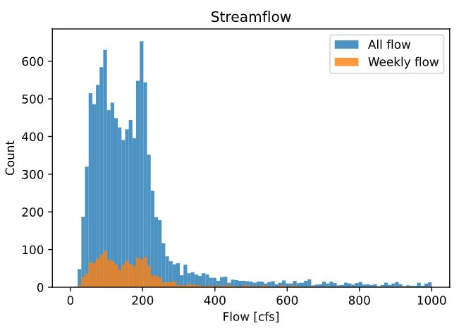
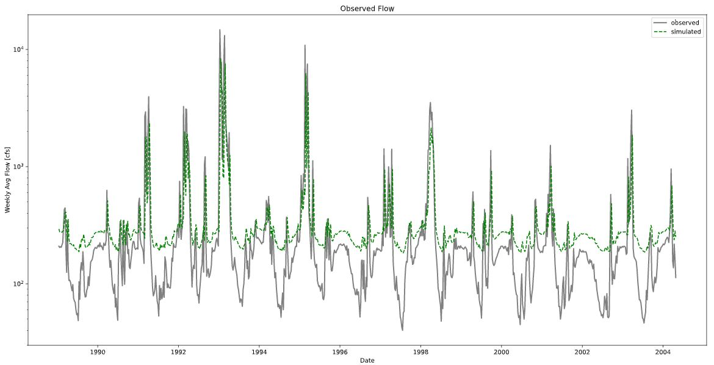
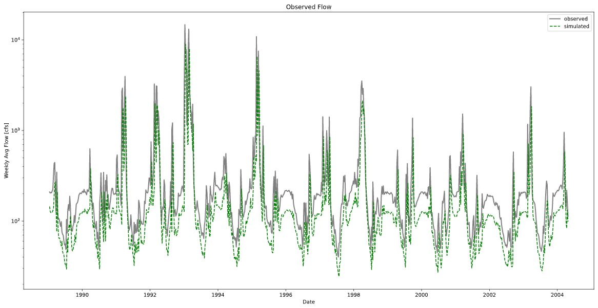
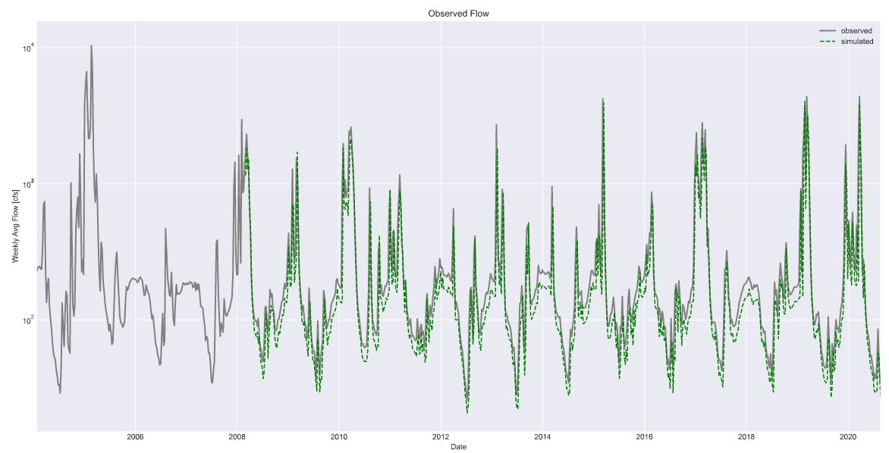
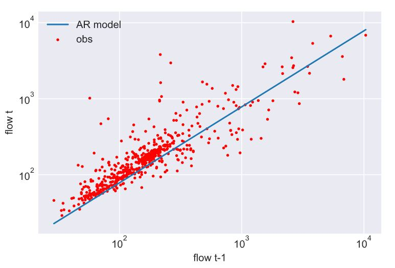

Patrick Neri; 10/4/2020 Assignment #6

# Homework #6
*by Patrick Neri*

One thing I needed to check right away was how representative a weekly sampling of data is compared to the overall flow.
I thought of 2 ways to assess this (without getting more complicated!). The first was visually, by comparing a histogram
of the overall flow data with the weekly sampling. Although this is good, it's hard to truly get a sense of the comparison
due to the difference in number of values. The other way I thought of was to look at the quartiles for the 2 groups. If the
values were representative, then the quartiles overall should be the same.

Method of flow quantiles for all data: [ 19. 158. 216. 480.]
Method of flow quantiles for weekly data: [ 26.57 159.42 220.42 536.25]

This data was done for 0% (min), 25%, 50%, and 75% respectively. Important things to notice from these values is the overall
shift upward. This is important in the context of our model picking an intercept.

Another thing to note was the models assumption of an intercept in the linear model and what that means physically.
Looking at the formula: **Flowt+1 = a0 + a1 * Flowt** we can see that if the previous week Flowt was somehow 0, then the next week would automatically be pushed to the intercept value a0. Indeed, this sets a forced minimal value outside of initial conditions. Looking at that, we would want _(if the model was to reflect physical reality)_ the value a0 to be perhaps the historical minimum.

Using the first model as is, we arrive at the values of:

**coefficient of determination: [0.31] intercept: [160.86] slope: [0.56]**

This implies that the model wouldn't produce any value lower that ~160.86. Looking at our quartiles, this implies that it would fail to represent over a **quarter** of real life values. So that sucks.

If we remove this forced intercept constraint, we get the values:

**coefficient of determination: [0.29] intercept: [0.0] slope: [0.61]**

We note that the coefficient of determination got a little bit worse, but it prevents a loss of reproducing lower values. Due to the simplicity of the model, I find this loss acceptable, and looking at a comparison, it does seem to better show the range of flow values. However, when we look at a graph of t-1 and t (equivalent to t+1 and t) we see a clear under-motion, due to the fact that, again non-reality, we have allowed values around zero, which has never happened historically. Ideally, we would want to be able to set the intercept value, perhaps at the minimum historical value of flow. Similarly, in values versus prediction, we see that it still predicts peaks well, but most other values are underestimated.

##### Questions
1.  For my final AR model, I took a running average of the previous 7 days, then segmented that into 1 value per week. Then I put that in place of my training data, which to better show the fact that we have had usually less flow in the past few years, I set my training data to be 400:1000 (1996-8-3 : 2008-2-3) which outputted a model of:

**Flowt+1 = a0 + a1 * Flowt**

With the values a0 = 0 , a1 = 0.78 , and a coefficient of determination 0.54.

2.  The model works okay, but is very unphysical. The values decay without new weekly input (because my intercept is zero) but if there is input such as the training data, we do see okay agreement.

3.  Despite the pretty graphs showing that the model might do okay, an r squared value of less than 0.80 only puts you in the ballpark anyway, so at that point I would rather trust my intuition! However to help refine my values I looked at the running weekly average frequency for each month to try and improve my predictions.
