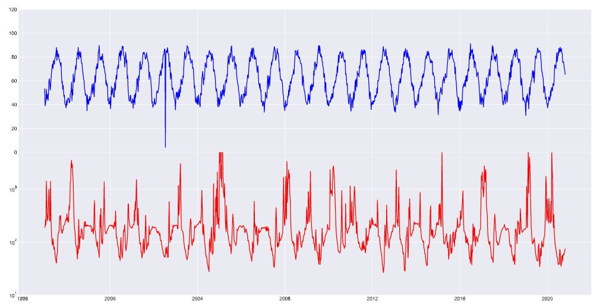

Patrick Neri; 10/26/2020 Assignment #9

# Homework #9
*by Patrick Neri*

### Summary
what went wrong. Well, I keep running into the issue of starting too late for my ambitions, then not being able to do the code they way I would want. This week really showed
me that if I want to produce the *impressive code* that I want to try and make, I will need to put in more time. I do cut myself some slack however, since API's is a very
big topic and I wasted literal hours trying to get the Daymet data to work, and then ended up not using it. I am interested in the future, and how peoples models will
be forced to change to adapt to the forced change that a seasonal shift that we are undergoing causes in the flow.

1. So for this forecast, a lot of what I had planned fell to ruin. However, after I ran my model, and looked at the information I had gathered, I came to the solution that
making human adjustments to model values seemed to make the most sense.
The reason for that is simple. With how the auto-regression model was behaving, it was clear either I was making a mistake or the barriers of such a simple relationship are
reaching their limits. I believe the later (partly because I want to pretend I know what I am doing) because of the consistent transition that occurs in flow data for this period
of the year. Looking at the previous many years, this time the flow starts to stabilize after the monsoon season and we see values go towards 100 almost every year during winter.
As such, I just went in and tweeked the results as I went to fit my infallible human assumptions.
2. For the dataset I added, I first tried to use the Daymet data, however I ran into the obvious issue that I couldn't get current values (they stopped at the end of last year?) Also I
became bitter at the dataset because I discovered that they didn't record leap days, which took me a while to figure out. Not cool.
The data I ended up using was the MesoWest data, specifically the temperature values of the station that was originally in the example code. I would have also liked to use the pressure and
relative humidity, but I couldn't figure out what I was doing wrong in time.
To access it I used a remote call to their API, because it was much faster to change relevant timestamps in the request then to go to the website and derive a url.
The location is given as Verde, and the lat & long are almost identical to the location of the streamflow data, meaning they should have a strong relationship.

3. This is my incredible graph. The top is the Temp in F, the bottom is the flow data on a log scale.

